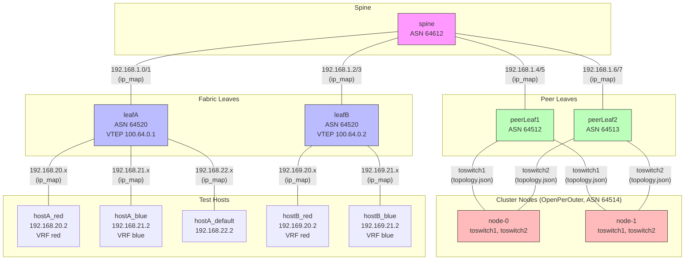

# E2E Test Network Topology

## Overview

The E2E tests simulate a data center fabric with spine-leaf routing, EVPN/VXLAN overlays, and cluster nodes running OpenPerOuter as a PE router.

IP source annotations:
- **ip_map** — assigned by `assign_ips` during clab setup (constant across platforms)
- **topology.json** — provided per-platform via `--infra-config` flag

## Network Diagram

## Data flow

1. **ip_map.txt** configures the constant clab fabric (spine, leafA/B, hosts)
2. **topology.json** describes the cluster↔fabric connectivity (varies per platform)
3. The test suite reads `topology.json` to configure BGP peering and neighbor lookups
4. OpenPerOuter on each node peers with the peer leaves via the underlay NICs

## Address sources by component

| Component | IP Source | Example |
|-----------|----------|---------|
| spine ↔ leafA | ip_map.txt | 192.168.1.0/1 |
| spine ↔ leafB | ip_map.txt | 192.168.1.2/3 |
| spine ↔ peerLeaf1 | ip_map.txt | 192.168.1.4/5 |
| spine ↔ peerLeaf2 | ip_map.txt | 192.168.1.6/7 |
| leafA ↔ hostA_red | ip_map.txt | 192.168.20.1/2 |
| leafB ↔ hostB_red | ip_map.txt | 192.169.20.1/2 |
| peerLeaf1 ↔ nodes | topology.json | varies by platform |
| peerLeaf2 ↔ nodes | topology.json | varies by platform |
| Underlay CR neighbors | topology.json | `underlayNeighbors` |
| Underlay CR NICs | topology.json | `underlayNics` |
